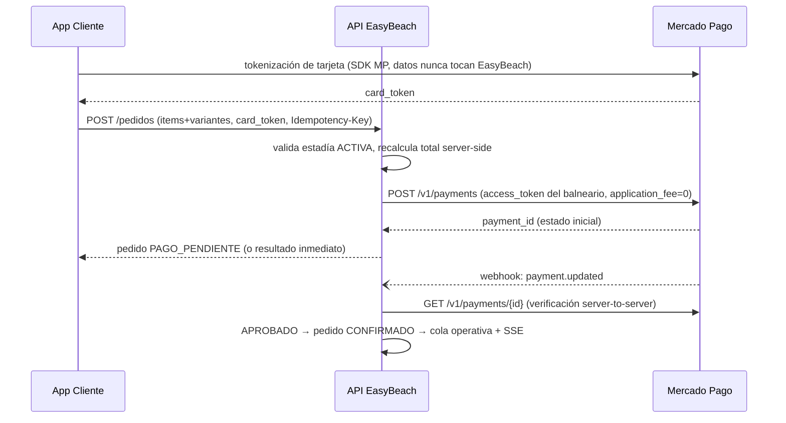

# ADR-004 — Pagos: Mercado Pago Checkout API, modelo marketplace sin comisión

- **Estado:** Aceptada (decisión de negocio cerrada en etapa 01)
- **Fecha:** 2026-07-07
- **Etapa:** 02

## Contexto

Decisión de negocio (etapa 01): pago online in-app por pedido, vía **Mercado
Pago Checkout API**, en modelo **marketplace/split sin comisión de
plataforma**: cada balneario cobra en su propia cuenta de MP, EasyBeach no
retiene nada (`application_fee = 0`) y en el resumen de tarjeta del cliente
aparece el descriptor del balneario, no EasyBeach. Este ADR fija la
arquitectura de esa integración.

## Arquitectura de la integración

### Vinculación (onboarding del balneario — etapa 10)

1. El admin del balneario inicia "Conectar Mercado Pago" desde su panel.
2. Flujo **OAuth de Mercado Pago**: autoriza a la aplicación EasyBeach sobre
   su cuenta; recibimos `access_token` + `refresh_token` del balneario.
3. Tokens cifrados en reposo (AES-GCM, clave fuera de la base — ver etapa 05);
   job de refresh antes de expiración; revocación al desvincular.
4. **Regla operativa:** sin vinculación MP activa, el balneario no acepta
   pedidos (el menú puede verse, el checkout se bloquea con mensaje claro).

### Flujo de cobro (por pedido — etapa 13)

Puntos normativos:
- El **monto lo calcula siempre el servidor** (precios congelados por variante
  + promociones); el cliente solo aporta el `card_token`.
- `application_fee` es una **constante 0 del servidor**, jamás un parámetro.
- **Idempotencia doble:** la clave de idempotencia del pedido evita duplicar
  pedido y cobro en reintentos por mala señal; el procesamiento del webhook es
  idempotente por `payment_id` + estado.
- **El webhook no se cree por fe:** ante cada notificación se valida la firma
  (`x-signature`, secret de la aplicación) y se **reconsulta el pago a la API
  de MP** antes de mover el pedido. La notificación es un aviso, no la verdad.
- **Reconciliación:** job periódico que consulta a MP los pagos en
  `PAGO_PENDIENTE` hace más de N minutos (webhook perdido/demorado) y resuelve.
- **Reembolso:** cancelación por el local de un pedido ya aprobado dispara
  refund vía API de MP con el token del balneario; queda registrado en
  `pedido_pago` (etapa 03).

### Máquina de estados (interacción pago ↔ pedido)

`CREADO → PAGO_PENDIENTE → CONFIRMADO` (pago aprobado) o `PAGO_RECHAZADO`
(reintentable: nuevo intento de pago sobre el mismo pedido). Un pedido **nunca
entra a la cola operativa sin pago aprobado**. Detalle completo en etapa 03.

## Consecuencias

- EasyBeach queda **fuera del alcance PCI** (tokenización del lado de MP) y
  fuera del flujo de fondos (no es agente de cobro): simplicidad legal e
  impositiva; la plata va directo del comprador al balneario.
- La plataforma depende de la disponibilidad de MP para vender: el fallback
  operativo (aceptar pedido sin pago) queda explícitamente **fuera del MVP**
  — decisión consciente para no abrir la puerta a pedidos incobrables.
- Multi-tenant también en pagos: el `access_token` usado se resuelve por el
  balneario del pedido; los tests cross-tenant (etapas 09/19) incluyen "un
  pago jamás se crea con el token de otro balneario".
- Pendiente operativo (no arquitectónico): confirmar con el área comercial de
  MP, al registrar la aplicación marketplace, que operar con
  `application_fee = 0` no requiere pasos adicionales.
