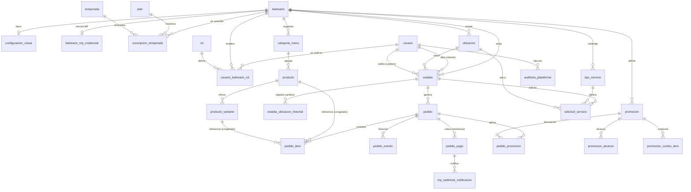
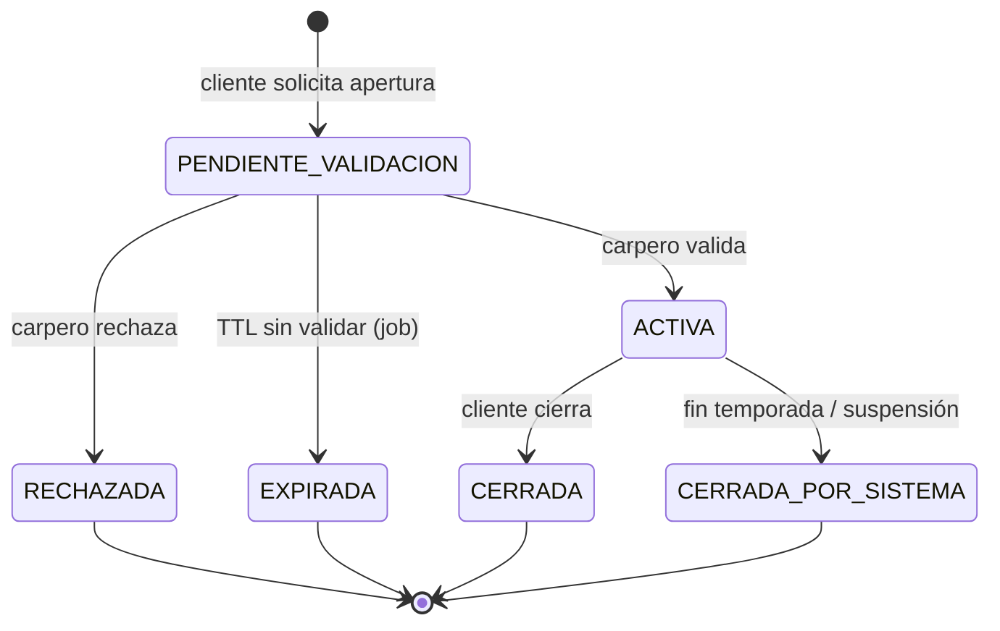
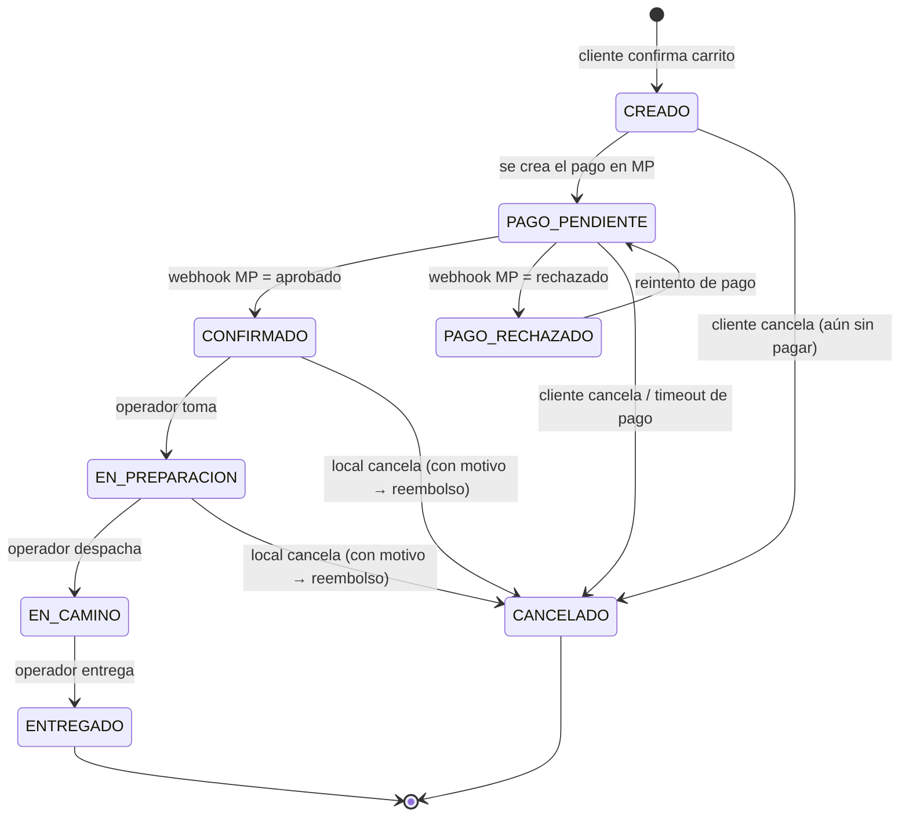
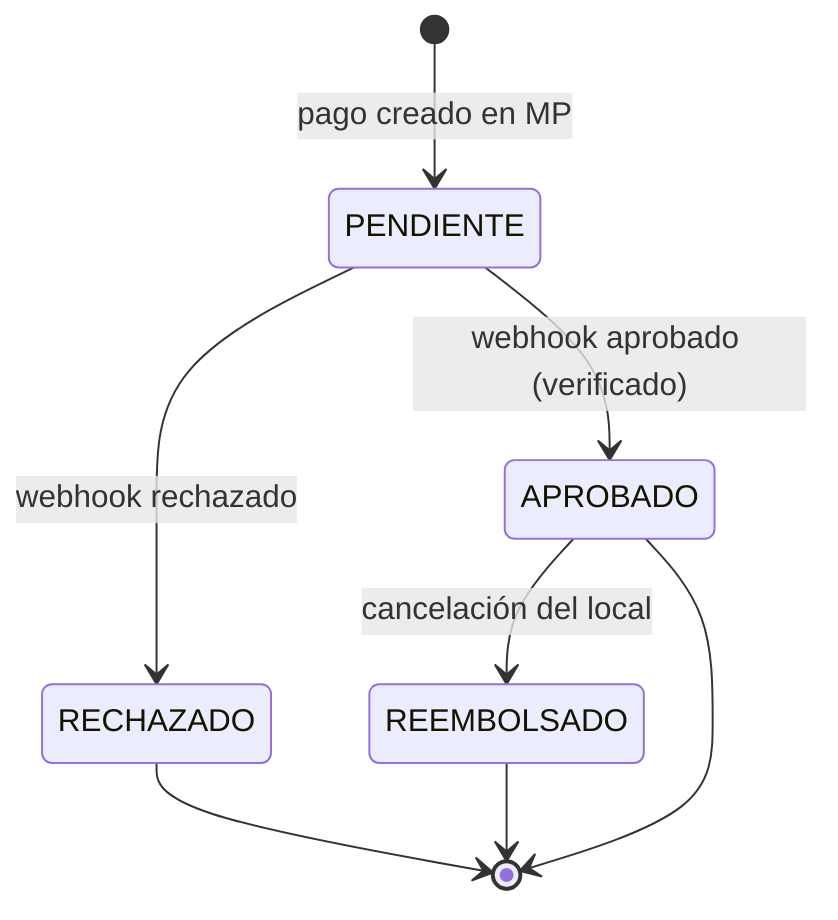
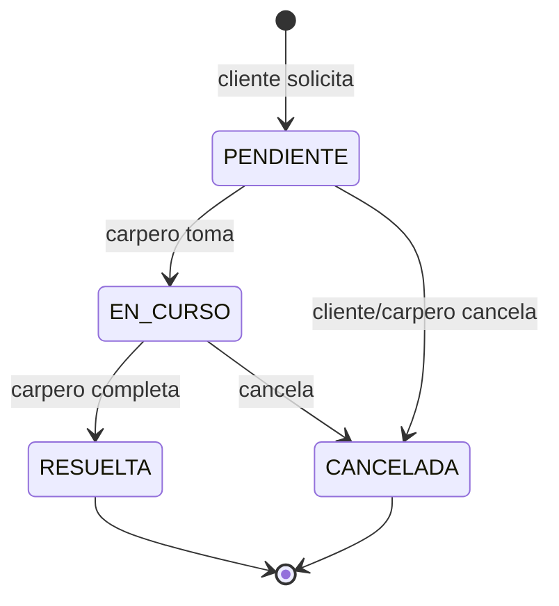

# Etapa 03 — Modelo de datos (MySQL)

- **Estado:** ejecutada — insumo directo de las etapas 04 (API), 05 (seguridad),
  09 (backend fundacional) y 11–15 (módulos backend).
- **Corresponde al plan:** [docs/etapas/03-modelo-de-datos.md](../etapas/03-modelo-de-datos.md)
- **Depende de:** [01 (visión/alcance)](01-vision-alcance-glosario.md),
  [02 (arquitectura)](02-arquitectura-general.md) y ADRs
  [001](../adr/ADR-001-multitenancy-base-compartida.md) /
  [004](../adr/ADR-004-pagos-mercadopago-marketplace.md) /
  [005](../adr/ADR-005-theming-runtime.md).

---

## 1. Convenciones (normativas)

| Tema | Decisión | Justificación |
|---|---|---|
| Motor / charset | InnoDB, `utf8mb4` / `utf8mb4_0900_ai_ci` (MySQL 8) | Transacciones ACID (flujo pedido↔pago), emojis y acentos correctos |
| Nombres | Tablas y columnas en **singular** `snake_case` (`pedido`, `pedido_item`, `producto_variante`) | Una sola convención sostenida; coincide con glosario y etapa 03 del plan |
| Clave primaria | `id BIGINT UNSIGNED AUTO_INCREMENT` interna | Compacta, buena localidad de índice, joins rápidos |
| Identificador público | `public_id CHAR(26)` (**ULID**) en entidades expuestas en URLs (`usuario`, `estadia`, `pedido`, `solicitud_servicio`) | Evita enumeración de IDs ajenos (amenaza de etapa 05); ULID es ordenable en el tiempo. `balneario` usa `slug` público |
| Multitenancy | `balneario_id BIGINT UNSIGNED` en **toda** tabla tenant-scoped; todo índice caliente arranca por él (ADR-001) | Aislamiento por discriminador + defensa en profundidad |
| Timestamps | `created_at`/`updated_at DATETIME(3)` en todas las tablas, **almacenados en UTC** | Auditoría universal; TZ de negocio `America/Argentina/Buenos_Aires` se aplica en consulta/reporte (etapa 02) |
| Soft-delete | `deleted_at DATETIME(3) NULL` **solo** en tablas referenciadas por históricos (`producto`, `producto_variante`, `categoria_menu`, `ubicacion`, `promocion`, `tipo_servicio`) | Un pedido histórico no puede quedar colgado si se borra un producto; el resto usa borrado real |
| Dinero | `DECIMAL(12,2)`, moneda ARS implícita (MVP mono-moneda) | Sin errores de float; en JSON viaja como string decimal (etapa 02) |
| Booleanos | `TINYINT(1)` (`0/1`) | Convención MySQL |
| Enums | Columna `VARCHAR` + `CHECK` (o validación en app) con valores en MAYÚSCULA, **no** tipo `ENUM` nativo | Agregar un valor a un `ENUM` nativo requiere `ALTER TABLE`; VARCHAR+CHECK es más flexible para máquinas de estado que evolucionan |
| FKs | Declaradas con `ON DELETE RESTRICT` por defecto (integridad explícita); cascadas solo en tablas hijas puras (`pedido_item`, `pedido_evento`) | Evita borrados en cascada accidentales entre módulos |

**Migraciones:** **Flyway** (SQL-first, encaja directo con Spring Boot, versiones
inmutables). Numeración `V<NNN>__<modulo>_<descripcion>.sql`, una migración por
incremento, nunca se edita una ya aplicada. Baseline por módulo (ver §7).

---

## 2. Diagrama entidad-relación

> Nota: `usuario` participa como **cliente** (dueño de la estadía) y como
> **carpero validador** en `estadia` (dos FKs distintas: `cliente_id` y
> `validada_por_usuario_id`).

---

## 3. Diccionario de datos

Convención de la tabla: **N** = nullable, **PK/FK/UK** = clave, `bal_id` =
`balneario_id`. Todas las tablas tienen `created_at`, `updated_at` (omitidos por
brevedad salvo relevancia). Toda tabla tenant-scoped lleva `balneario_id NOT NULL`.

### 3.1 Tenancy / plataforma

**`balneario`** (el tenant; no es tenant-scoped)
| Columna | Tipo | N | Notas |
|---|---|---|---|
| id | BIGINT UN PK | | |
| slug | VARCHAR(60) UK | | Identificador público en URLs (`/balnearios/{slug}`) |
| nombre | VARCHAR(120) | | |
| email_contacto | VARCHAR(160) | | |
| telefono | VARCHAR(40) | N | |
| estado | VARCHAR(20) | | `ACTIVO` \| `SUSPENDIDO` |

- **Regla:** un balneario `SUSPENDIDO` no acepta estadías ni pedidos nuevos
  (validado en service); estado operativo efectivo = `estado=ACTIVO` **y**
  existe `suscripcion_temporada` vigente en la temporada actual.

**`configuracion_visual`** (1:1 con balneario — theming white-label, ADR-005)
| Columna | Tipo | N | Notas |
|---|---|---|---|
| id | BIGINT UN PK | | |
| balneario_id | BIGINT UN UK FK | | 1:1 |
| theme_version | INT | | Versión del contrato de tokens (etapa 06) |
| tokens | JSON | | Mapa de tokens de color/tipografía (`color.primary`, `typography.family`, …) |
| logo_url | VARCHAR(500) | N | |
| portada_url | VARCHAR(500) | N | |
| splash_url | VARCHAR(500) | N | |

- **Regla:** `tokens` valida contra el contrato versionado; tokens desconocidos
  se ignoran, faltantes toman default del design system (ADR-005).

**`plan`** (catálogo comercial; platform-level)
| id BIGINT UN PK · nombre VARCHAR(80) · descripcion VARCHAR(400) N · precio DECIMAL(12,2) · activo TINYINT(1) |

**`temporada`** (platform-level)
| id BIGINT UN PK · nombre VARCHAR(60) (ej. "Verano 2026/27") · fecha_inicio DATE · fecha_fin DATE · estado VARCHAR(20) (`PLANIFICADA`\|`EN_CURSO`\|`CERRADA`) |

**`suscripcion_temporada`** (balneario × plan × temporada)
| Columna | Tipo | N | Notas |
|---|---|---|---|
| id | BIGINT UN PK | | |
| balneario_id | BIGINT UN FK | | |
| plan_id | BIGINT UN FK | | |
| temporada_id | BIGINT UN FK | | |
| estado | VARCHAR(20) | | `PENDIENTE`\|`ACTIVA`\|`SUSPENDIDA`\|`FINALIZADA` |
| fecha_alta | DATETIME(3) | | |

- **UK:** (`balneario_id`, `temporada_id`) — un balneario, una suscripción por
  temporada.

### 3.2 Identidad

**`usuario`** (cliente global o staff; `balneario_id` NO aplica — el vínculo staff va aparte)
| Columna | Tipo | N | Notas |
|---|---|---|---|
| id | BIGINT UN PK | | |
| public_id | CHAR(26) UK | | ULID |
| email | VARCHAR(160) UK | | |
| password_hash | VARCHAR(100) | | bcrypt/argon2 (etapa 05) |
| nombre | VARCHAR(120) | | |
| tipo | VARCHAR(20) | | `CLIENTE` \| `STAFF` \| `SUPER_ADMIN` |
| estado | VARCHAR(20) | | `ACTIVO` \| `BAJA` |

**`rol`** (catálogo) — `id · codigo` (`CLIENTE`,`CARPERO`,`OPERADOR`,`ADMIN_BALNEARIO`,`SUPER_ADMIN`) · `nombre`

**`usuario_balneario_rol`** (staff pertenece a un balneario con un rol)
| id BIGINT UN PK · usuario_id FK · balneario_id FK · rol_id FK · UK(usuario_id, balneario_id, rol_id) |

- **Regla:** el cliente (global) no tiene fila acá; su tenant operativo sale de
  la estadía validada, nunca de un parámetro (ADR-001). El JWT de staff toma
  `balneario_id` + `rol` de esta tabla.

### 3.3 Operación física

**`ubicacion`**
| id · public — no · balneario_id FK · tipo VARCHAR(16) (`CARPA`\|`SOMBRILLA`\|`MESA`\|`SECTOR`) · identificador VARCHAR(40) ("Carpa 12") · estado VARCHAR(16) (`ACTIVA`\|`INACTIVA`) · deleted_at N |

- **UK:** (`balneario_id`, `identificador`) entre no borradas.
- **Regla:** no se desactiva/borra una ubicación con estadía activa (validado en
  service).

### 3.4 Catálogo

**`categoria_menu`** — `id · balneario_id FK · nombre VARCHAR(80) · orden INT · activa TINYINT(1) · deleted_at N`

**`producto`**
| Columna | Tipo | N | Notas |
|---|---|---|---|
| id | BIGINT UN PK | | |
| balneario_id | BIGINT UN FK | | |
| categoria_id | BIGINT UN FK | | |
| nombre | VARCHAR(120) | | |
| descripcion | VARCHAR(500) | N | |
| precio_base | DECIMAL(12,2) | | Usado cuando el producto **no** tiene variantes |
| foto_url | VARCHAR(500) | N | |
| disponible | TINYINT(1) | | On/off inmediato (etapa 11) |
| orden | INT | | Orden comercial en la categoría |
| deleted_at | DATETIME(3) | N | |

**`producto_variante`** (variantes simples de un nivel — etapa 01)
| id · balneario_id FK · producto_id FK · nombre VARCHAR(80) ("Grande","Sin hielo") · precio DECIMAL(12,2) (precio **absoluto** de la variante) · disponible TINYINT(1) · orden INT · deleted_at N |

- **Regla:** si un producto tiene ≥1 variante, el cliente **debe** elegir una y
  el precio autoritativo es `producto_variante.precio`; si no tiene variantes,
  se usa `producto.precio_base`.

### 3.5 Estadía

**`estadia`**
| Columna | Tipo | N | Notas |
|---|---|---|---|
| id | BIGINT UN PK | | |
| public_id | CHAR(26) UK | | ULID |
| balneario_id | BIGINT UN FK | | |
| cliente_id | BIGINT UN FK→usuario | | |
| ubicacion_id | BIGINT UN FK | | Ubicación actual |
| estado | VARCHAR(24) | | `PENDIENTE_VALIDACION`\|`ACTIVA`\|`RECHAZADA`\|`CERRADA`\|`CERRADA_POR_SISTEMA`\|`EXPIRADA` |
| activa_uk | BIGINT UN | N | = `cliente_id` mientras ocupa cupo (PENDIENTE/ACTIVA); `NULL` si terminal |
| fecha_solicitud | DATETIME(3) | | |
| validada_por_usuario_id | BIGINT UN FK→usuario | N | Carpero que validó |
| fecha_validacion | DATETIME(3) | N | |
| fecha_cierre | DATETIME(3) | N | |

- **Unicidad "una estadía activa por cliente y balneario"** (etapa 01), a nivel
  DB: **UK (`balneario_id`, `activa_uk`)**. Como MySQL trata múltiples `NULL`
  como distintos, las estadías terminales (`activa_uk=NULL`) no colisionan; solo
  puede existir una fila con `activa_uk=cliente_id` por balneario. La app setea
  `activa_uk=cliente_id` al abrir y a `NULL` al cerrar/rechazar/expirar. Esto
  hace la regla **imposible de violar por concurrencia**, no solo por validación
  en código.
- **Regla de cierre:** no se cierra una estadía con pedidos en curso (estados no
  terminales); política exacta (bloquear vs. cancelar) definida en etapa 12.

**`estadia_ubicacion_historial`** (cambios de ubicación — etapa 12)
| id · estadia_id FK · balneario_id FK · ubicacion_id FK · desde DATETIME(3) · hasta DATETIME(3) N |

### 3.6 Pedidos

**`pedido`**
| Columna | Tipo | N | Notas |
|---|---|---|---|
| id | BIGINT UN PK | | |
| public_id | CHAR(26) UK | | ULID |
| balneario_id | BIGINT UN FK | | |
| estadia_id | BIGINT UN FK | | |
| cliente_id | BIGINT UN FK→usuario | | Denormalizado para reportes |
| ubicacion_id | BIGINT UN FK | | Ubicación de entrega al momento del pedido |
| estado | VARCHAR(20) | | Ver máquina §4.2 |
| idempotency_key | VARCHAR(80) | | Header `Idempotency-Key` |
| subtotal | DECIMAL(12,2) | | Suma de líneas, sin descuentos |
| descuento_total | DECIMAL(12,2) | | Suma de `pedido_promocion.monto_descuento` |
| total | DECIMAL(12,2) | | `subtotal - descuento_total`; monto cobrado a MP |

- **UK:** (`balneario_id`, `idempotency_key`) — reintento por mala señal no
  duplica pedido ni cobro (ADR-004).
- **Regla:** `subtotal`/`descuento_total`/`total` se **calculan server-side**;
  el cliente nunca los aporta.

**`pedido_item`** (snapshot congelado e inmutable)
| Columna | Tipo | N | Notas |
|---|---|---|---|
| id | BIGINT UN PK | | |
| pedido_id | BIGINT UN FK | | `ON DELETE CASCADE` |
| balneario_id | BIGINT UN FK | | |
| producto_id | BIGINT UN FK | N | Referencia blanda (el producto puede borrarse luego) |
| producto_variante_id | BIGINT UN FK | N | Variante elegida, si aplica |
| nombre_producto | VARCHAR(120) | | **Congelado** al momento del pedido |
| nombre_variante | VARCHAR(80) | N | **Congelado** |
| precio_unitario | DECIMAL(12,2) | | **Congelado** (de la variante o `precio_base`) |
| cantidad | INT UN | | |
| subtotal_linea | DECIMAL(12,2) | | `precio_unitario * cantidad` |

- **Regla (criterio de aceptación):** el precio del ítem queda **congelado**;
  jamás referencia al precio vigente del producto/variante. Los `nombre_*` se
  copian para que el histórico sea legible aunque el catálogo cambie.

**`pedido_evento`** (auditoría de transiciones)
| id · pedido_id FK (CASCADE) · balneario_id FK · estado_anterior VARCHAR(20) N · estado_nuevo VARCHAR(20) · actor_usuario_id FK N (NULL = sistema) · actor_tipo VARCHAR(20) · motivo VARCHAR(300) N · created_at |

### 3.7 Pagos (Mercado Pago — ADR-004)

**`balneario_mp_credencial`** (1:1 con balneario; tokens OAuth cifrados)
| Columna | Tipo | N | Notas |
|---|---|---|---|
| id | BIGINT UN PK | | |
| balneario_id | BIGINT UN UK FK | | 1:1 |
| mp_user_id | VARCHAR(40) | | Collector (cuenta MP del balneario) |
| access_token_cifrado | VARBINARY(512) | | **Cifrado AES-GCM**, clave fuera de la DB (etapa 05) |
| refresh_token_cifrado | VARBINARY(512) | | Cifrado |
| token_expira_at | DATETIME(3) | | Job de refresh anticipado |
| scope | VARCHAR(120) | N | |
| estado | VARCHAR(20) | | `VINCULADA`\|`DESVINCULADA`\|`EXPIRADA` |

- **Regla (criterio de aceptación):** los tokens **nunca** se guardan en claro
  ni aparecen en logs. Sin credencial `VINCULADA`, el balneario no cobra.

**`pedido_pago`** (1:N con pedido — reintentos; a lo sumo uno `APROBADO`)
| Columna | Tipo | N | Notas |
|---|---|---|---|
| id | BIGINT UN PK | | |
| pedido_id | BIGINT UN FK | | |
| balneario_id | BIGINT UN FK | | |
| estado | VARCHAR(16) | | `PENDIENTE`\|`APROBADO`\|`RECHAZADO`\|`REEMBOLSADO` |
| monto | DECIMAL(12,2) | | Debe igualar `pedido.total` |
| mp_preference_id | VARCHAR(80) | N | |
| mp_payment_id | VARCHAR(40) | N | Índice para lookup por webhook |
| mp_status_detail | VARCHAR(80) | N | Detalle devuelto por MP |
| metodo | VARCHAR(40) | N | Tarjeta/QR/etc. |

- **Regla:** a lo sumo un `pedido_pago` en `APROBADO` por pedido (validado en
  service; el pedido pasa a `CONFIRMADO` solo con ese estado). El monto se
  verifica contra `pedido.total` al aprobar.

**`mp_webhook_notificacion`** (idempotencia + auditoría del webhook)
| id · balneario_id FK · mp_payment_id VARCHAR(40) · tipo VARCHAR(40) · payload_hash CHAR(64) · recibido_at DATETIME(3) · procesado TINYINT(1) · resultado VARCHAR(40) N · UK(mp_payment_id, tipo, payload_hash) |

- **Regla:** notificación repetida (mismo `mp_payment_id`+`tipo`+hash) no se
  re-procesa (idempotencia del webhook, ADR-004). Ante cada notificación se
  **reconsulta el pago a MP** antes de mover el pedido.

### 3.8 Servicios al carpero

**`tipo_servicio`** (configurable por admin — etapa 14) — `id · balneario_id FK · nombre VARCHAR(80) · activo TINYINT(1) · orden INT · deleted_at N`

**`solicitud_servicio`**
| id · public_id CHAR(26) UK · balneario_id FK · estadia_id FK · ubicacion_id FK · tipo_servicio_id FK · nota VARCHAR(300) N · estado VARCHAR(16) (`PENDIENTE`\|`EN_CURSO`\|`RESUELTA`\|`CANCELADA`) · atendida_por_usuario_id FK N |

- Sin cobro en MVP (etapa 01): no hay `pedido_pago` asociado.

### 3.9 Promociones

**`promocion`**
| Columna | Tipo | N | Notas |
|---|---|---|---|
| id | BIGINT UN PK | | |
| balneario_id | BIGINT UN FK | | |
| nombre | VARCHAR(120) | | |
| tipo | VARCHAR(24) | | `DESCUENTO_PORCENTUAL`\|`COMBO`\|`HAPPY_HOUR` |
| estado | VARCHAR(16) | | `ACTIVA`\|`INACTIVA` |
| valor | DECIMAL(12,2) | | % (para descuento/happy hour) o precio fijo del combo |
| vigencia_desde | DATE | N | |
| vigencia_hasta | DATE | N | |
| franja_hora_desde | TIME | N | Happy hour |
| franja_hora_hasta | TIME | N | Happy hour |
| dias_semana | VARCHAR(20) | N | Happy hour (ej. "LUN,MAR,...") |
| deleted_at | DATETIME(3) | N | |

**`promocion_alcance`** (a qué aplica un `%`/happy hour) — `id · promocion_id FK · balneario_id FK · tipo_alcance VARCHAR(12) (`PRODUCTO`\|`CATEGORIA`) · referencia_id BIGINT UN`

**`promocion_combo_item`** (productos que forman un combo) — `id · promocion_id FK · balneario_id FK · producto_id FK · cantidad INT UN`

**`pedido_promocion`** (promos aplicadas a un pedido — reportes etapa 15; congelado)
| id · pedido_id FK (CASCADE) · balneario_id FK · promocion_id FK N (blanda) · nombre_promocion VARCHAR(120) (congelado) · monto_descuento DECIMAL(12,2) |

- **Regla:** el descuento aplicado queda **congelado** en el pedido; una promo
  vencida/desactivada luego no altera pedidos históricos (etapa 14).

### 3.10 Auditoría

**`auditoria_plataforma`** (acciones de Super Admin y ops sensibles — etapa 10)
| id · actor_usuario_id FK · accion VARCHAR(60) · entidad_tipo VARCHAR(40) · entidad_id BIGINT UN N · balneario_id FK N · detalle JSON N · created_at |

---

## 4. Máquinas de estado

### 4.1 Estadía

| Transición | Quién | Reglas |
|---|---|---|
| → PENDIENTE_VALIDACION | Cliente | Balneario operativo; no existe otra estadía con `activa_uk` en ese balneario |
| PENDIENTE_VALIDACION → ACTIVA | Carpero | Setea `validada_por_usuario_id`, `fecha_validacion` |
| PENDIENTE_VALIDACION → RECHAZADA | Carpero | `activa_uk=NULL` |
| PENDIENTE_VALIDACION → EXPIRADA | Sistema (job) | TTL configurable; `activa_uk=NULL` |
| ACTIVA → CERRADA | Cliente | Sin pedidos en curso (política etapa 12); `activa_uk=NULL` |
| ACTIVA → CERRADA_POR_SISTEMA | Sistema | Suspensión/fin de temporada; distinguible en reportes; `activa_uk=NULL` |

- **Sin pedidos activos**: solo `ACTIVA` permite crear pedidos. `EXPIRADA`/
  `CERRADA_POR_SISTEMA` se distinguen del cierre normal para reportes (etapa 15).

### 4.2 Pedido

| Transición | Quién | Reglas |
|---|---|---|
| → CREADO | Cliente | Estadía `ACTIVA`; productos/variantes disponibles; total server-side; idempotencia |
| CREADO → PAGO_PENDIENTE | Sistema | Crea pago contra cuenta MP del balneario (`application_fee=0`) |
| PAGO_PENDIENTE → CONFIRMADO | Sistema (webhook) | **Solo** tras reconsultar el pago a MP; **entra a la cola operativa aquí** |
| PAGO_PENDIENTE → PAGO_RECHAZADO | Sistema (webhook) | Reintentable |
| CONFIRMADO/EN_PREPARACION → CANCELADO | Operador/Admin | Requiere `motivo`; dispara **reembolso** MP y `pedido_pago`=`REEMBOLSADO` |
| EN_PREPARACION → EN_CAMINO → ENTREGADO | Operador | Ítems físicos; el cliente solo cancela en estados tempranos |

- **Invariante clave:** un pedido **nunca** aparece en la cola operativa sin
  pago `APROBADO`. Toda transición se registra en `pedido_evento`.

### 4.3 Pago

### 4.4 Solicitud de servicio

### 4.5 Suscripción de temporada

`PENDIENTE → ACTIVA` (alta confirmada) · `ACTIVA ↔ SUSPENDIDA` (Super Admin) ·
`ACTIVA/SUSPENDIDA → FINALIZADA` (fin de temporada). Solo `ACTIVA` habilita
operación del balneario.

---

## 5. Estrategia de índices

Todo índice tenant-scoped **arranca por `balneario_id`**. Índices por consulta
caliente:

| Consulta caliente | Tabla | Índice |
|---|---|---|
| Menú público (categorías ordenadas) | categoria_menu | (`balneario_id`, `activa`, `orden`) |
| Menú público (productos disponibles) | producto | (`balneario_id`, `categoria_id`, `disponible`, `orden`) |
| Variantes de un producto | producto_variante | (`balneario_id`, `producto_id`, `disponible`) |
| Estadía activa por cliente+balneario | estadia | **UK** (`balneario_id`, `activa_uk`) |
| Mis estadías (cliente, todos los balnearios) | estadia | (`cliente_id`, `estado`) |
| Cola operativa de pedidos | pedido | (`balneario_id`, `estado`, `created_at`) |
| Pedidos de una estadía | pedido | (`estadia_id`, `created_at`) |
| Idempotencia de pedido | pedido | **UK** (`balneario_id`, `idempotency_key`) |
| Lookup de pago por webhook | pedido_pago | (`mp_payment_id`) |
| Cola de solicitudes de servicio | solicitud_servicio | (`balneario_id`, `estado`, `created_at`) |
| Promos vigentes | promocion | (`balneario_id`, `estado`, `vigencia_desde`, `vigencia_hasta`) |
| Reporte de ventas por rango | pedido | (`balneario_id`, `estado`, `created_at`) *(reutiliza cola)* |
| Auditoría por balneario | auditoria_plataforma | (`balneario_id`, `created_at`) |

- **Unicidad de negocio en DB (no solo en código):** estadía activa
  (`balneario_id`,`activa_uk`), idempotencia de pedido, `balneario_id`+
  `temporada_id` en suscripción, `mp_payment_id`+`tipo`+hash en webhook.

---

## 6. Matriz feature (etapa 01) → tablas

| Feature MVP | Tablas |
|---|---|
| Multibalneario / ABM balnearios | `balneario`, `auditoria_plataforma` |
| Theming white-label | `configuracion_visual` |
| Vinculación Mercado Pago (OAuth) | `balneario_mp_credencial` |
| Planes y temporadas (SaaS) | `plan`, `temporada`, `suscripcion_temporada` |
| Usuarios y roles | `usuario`, `rol`, `usuario_balneario_rol` |
| Selección de balneario | `balneario`, `configuracion_visual` |
| Ubicaciones | `ubicacion` |
| Menú con categorías, productos y variantes | `categoria_menu`, `producto`, `producto_variante` |
| Estadía activa (validada por carpero) | `estadia`, `estadia_ubicacion_historial` |
| Carrito → pedido por ubicación | `pedido`, `pedido_item` |
| Estados de pedido / tiempo real | `pedido`, `pedido_evento` |
| Pago in-app (MP) | `pedido_pago`, `mp_webhook_notificacion`, `balneario_mp_credencial` |
| Servicios al carpero | `tipo_servicio`, `solicitud_servicio` |
| Promociones básicas | `promocion`, `promocion_alcance`, `promocion_combo_item`, `pedido_promocion` |
| Reportes básicos | (lectura sobre) `pedido`, `pedido_item`, `pedido_promocion`, `estadia`, `solicitud_servicio` |

Cobertura completa: cada feature del alcance MVP tiene entidades.

---

## 7. Plan de migraciones (Flyway)

Una migración por módulo en el baseline; luego incrementales. Numeración
`V<NNN>__<modulo>_<desc>.sql`:

| Versión | Contenido |
|---|---|
| `V001__tenancy_baseline.sql` | `balneario`, `configuracion_visual`, `plan`, `temporada`, `suscripcion_temporada` |
| `V002__identity.sql` | `usuario`, `rol`, `usuario_balneario_rol` + seed de `rol` |
| `V003__operacion_fisica.sql` | `ubicacion` |
| `V004__catalogo.sql` | `categoria_menu`, `producto`, `producto_variante` |
| `V005__estadia.sql` | `estadia`, `estadia_ubicacion_historial` |
| `V006__pedidos.sql` | `pedido`, `pedido_item`, `pedido_evento` |
| `V007__pagos.sql` | `balneario_mp_credencial`, `pedido_pago`, `mp_webhook_notificacion` |
| `V008__concierge.sql` | `tipo_servicio`, `solicitud_servicio` |
| `V009__promociones.sql` | `promocion`, `promocion_alcance`, `promocion_combo_item`, `pedido_promocion` |
| `V010__auditoria.sql` | `auditoria_plataforma` |

- Migraciones **inmutables** una vez aplicadas; cambios posteriores = nueva
  versión. El seed de datos demo (etapa 19) va por Flyway callback o script
  aparte, nunca mezclado con el DDL de baseline.

---

## 8. Decisiones abiertas (a resolver en su etapa, no bloquean el modelo)

1. **TTL de expiración** de estadías `PENDIENTE_VALIDACION` sin validar: valor
   concreto → etapa 12.
2. **Política de cierre** de estadía con pedidos en curso (bloquear vs. forzar
   cancelación): → etapa 12.
3. **Combinación de promociones** (¿se acumulan? Propuesta MVP: no, gana la
   mejor para el cliente): la regla de cálculo → etapa 14; el modelo ya soporta
   registrar N `pedido_promocion` por si evoluciona.
4. **Reembolsos parciales**: el MVP asume reembolso total del pedido; el modelo
   (`pedido_pago.estado=REEMBOLSADO`) no cubre parcial — se marca como evolución.
