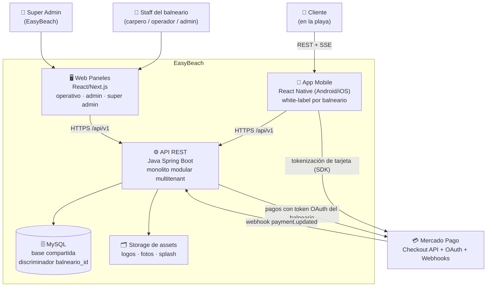

# Etapa 02 — Arquitectura general y estrategia multitenant

- **Estado:** ejecutada — insumo directo de las etapas 03 (datos), 04 (API),
  05 (seguridad) y 09 (backend fundacional).
- **Corresponde al plan:** [docs/etapas/02-arquitectura-multitenant.md](../etapas/02-arquitectura-multitenant.md)
- **Decisiones estructurales (ADRs):**
  - [ADR-001 — Multitenancy: base compartida con `balneario_id`](../adr/ADR-001-multitenancy-base-compartida.md)
  - [ADR-002 — Monolito modular por capas](../adr/ADR-002-monolito-modular.md)
  - [ADR-003 — Tiempo real: SSE con fallback polling](../adr/ADR-003-tiempo-real-sse.md)
  - [ADR-004 — Pagos: Mercado Pago marketplace sin comisión](../adr/ADR-004-pagos-mercadopago-marketplace.md)
  - [ADR-005 — Theming white-label runtime](../adr/ADR-005-theming-runtime.md)

## 1. Contexto del sistema (C4 nivel 1)

Lecturas clave del diagrama:
- **Un solo backend y una sola base** sirven a todos los balnearios
  (ADR-001); el aislamiento es lógico y defendido en profundidad.
- La plata **no pasa por EasyBeach**: la app tokeniza la tarjeta directo
  contra MP y la API crea el pago contra la cuenta del balneario (ADR-004).
- La app es **una sola** en las stores y se transforma por theme runtime
  (ADR-005).

## 2. Módulos del backend (C4 nivel 2 / ADR-002)

| Módulo | Responsabilidad | Entidades principales | Depende de |
|---|---|---|---|
| `platform` | Balnearios, planes, temporadas, suscripciones, estado operativo, auditoría de Super Admin | balneario, plan, temporada, suscripcion_temporada | identity, shared |
| `identity` | Usuarios (clientes globales y staff por balneario), auth JWT, roles | usuario, rol | shared |
| `branding` | Configuración visual white-label, tokens de theming, assets | configuracion_visual | platform, shared |
| `catalog` | Categorías, productos, **variantes**, disponibilidad | categoria_menu, producto, producto_variante | platform, shared |
| `stay` | Estadía: solicitud, validación por carpero, cambio de ubicación, cierre; ubicaciones físicas | estadia, ubicacion | identity, platform, shared |
| `ordering` | Carrito→pedido, máquina de estados, colas operativas, totales | pedido, pedido_item, pedido_evento | stay, catalog, promotions, payments, shared |
| `payments` | Integración MP: OAuth por balneario, creación de pago, webhook, reconciliación, reembolsos | pedido_pago, balneario_mp_credencial | platform, shared |
| `concierge` | Tipos y solicitudes de servicio al carpero | tipo_servicio, solicitud_servicio | stay, shared |
| `promotions` | Promociones (%, combo, happy hour), vigencia, cálculo | promocion | catalog, shared |
| `reporting` | Reportes y KPIs, solo lectura (queries propias) | — (read models) | shared |
| `shared` | Errores, paginación, TenantContext, eventos, dinero/fechas | — | — |

Reglas de dependencia y comunicación entre módulos: ver ADR-002 (interfaces de
service + eventos; prohibido cruzar repositorios; verificado con ArchUnit).

### Eventos de dominio (contrato interno)

| Evento | Emisor | Consumidores (MVP) |
|---|---|---|
| `EstadiaSolicitada` | stay | SSE operativo (bandeja del carpero) |
| `EstadiaValidada` / `EstadiaRechazada` | stay | SSE cliente |
| `EstadiaCerrada` | stay | reporting |
| `PedidoCreado` | ordering | payments (inicia cobro) |
| `PagoAprobado` / `PagoRechazado` | payments | ordering (transición de estado), SSE cliente |
| `PedidoConfirmado` | ordering | SSE operativo (entra a cola) |
| `PedidoEstadoCambiado` | ordering | SSE cliente, reporting |
| `SolicitudServicioCreada` / `...Resuelta` | concierge | SSE operativo / SSE cliente |

Todos con `@TransactionalEventListener(AFTER_COMMIT)`: ningún evento sale si
la transacción no confirmó.

## 3. Multitenancy (resumen operativo de ADR-001)

- Tenant del **staff**: claim `balneario_id` del JWT. Tenant del **cliente**:
  del path público o del recurso (estadía/pedido) validado en servidor. Nunca
  de un campo libre.
- `TenantContext` request-scoped + Hibernate `@Filter` automático sobre
  entidades `@TenantScoped` + aserción de pertenencia en service para cargas
  por id + batería de tests cross-tenant en CI. Tres capas independientes.
- Operaciones cross-tenant: solo Super Admin, con contexto explícito y
  auditado.

## 4. Arquitectura frontend

### App mobile (React Native — etapa 16)
- **Estado remoto por REST + eventos por SSE** (ADR-003) con polling de
  respaldo; toda vista es reconstruible por GET (la playa corta conexiones).
- **Theming white-label runtime** (ADR-005): ThemeProvider raíz, tokens
  servidos por el endpoint público de branding, cache local con ETag,
  tipografías del set curado embebidas, cero estilos hardcodeados (lint).
- **Resiliencia de escritura:** toda creación de pedido viaja con
  `Idempotency-Key`; reintentos seguros ante timeout; cache del menú con
  revalidación.
- **Pagos:** el SDK de MP tokeniza la tarjeta en el dispositivo; la app nunca
  ve ni persiste datos de tarjeta (ADR-004).

### Web paneles (Next.js — etapas 17/18)
- Una sola app Next.js con áreas por rol (operativo / admin / super admin) y
  guardas de ruta por rol del JWT (matriz de la etapa 05).
- Panel operativo: SSE del canal `operativo` + refetch de cola al reconectar;
  pensado para tablet.
- Marca EasyBeach (los paneles no son white-label); el preview del theme en el
  panel admin renderiza con los mismos tokens que mobile.

## 5. Decisiones transversales

| Tema | Decisión |
|---|---|
| Versionado API | Prefijo `/api/v1`; cambios incompatibles ⇒ `/v2` (no se rompe `/v1` en temporada) |
| Errores | RFC 7807 (`application/problem+json`) con `code` de negocio estable |
| Paginación | Offset (`page`, `size`, máx. 100) — suficiente al volumen del MVP |
| Fechas | ISO 8601 con offset; TZ de negocio `America/Argentina/Buenos_Aires` |
| Moneda | ARS; `DECIMAL(12,2)` en MySQL; en JSON, string decimal (`"1500.00"`) para evitar float |
| Idempotencia | Header `Idempotency-Key` obligatorio en `POST /pedidos`; webhook idempotente por `payment_id` |
| Auditoría | `created_at`/`updated_at` en todo; `pedido_evento` para pedidos; tabla de auditoría para acciones de Super Admin y validaciones de estadía |
| Borrado | Soft-delete en catálogo/ubicaciones/promociones (referenciados por históricos); borrado real solo donde no hay referencias |
| Logs | Estructurados con `request_id` + `balneario_id`; nunca tokens ni PII |

## 6. Supuestos de escala (documentados, a validar con negocio)

| Métrica | Supuesto año 1 |
|---|---|
| Balnearios activos | 10–30 |
| Clientes concurrentes pico (sábado de enero) | 5.000–15.000 |
| Pedidos/min pico en toda la plataforma | 100–200 |
| Conexiones SSE simultáneas pico | ~5.000–10.000 |

Consecuencia: una instancia bien dimensionada del monolito + MySQL gestionado
alcanza; el diseño no bloquea réplicas horizontales (el único estado en
memoria son los emitters SSE — su evolución está descripta en ADR-003).
La prueba de carga de la etapa 19 usa estos números.

## 7. Riesgos principales y mitigación

| Riesgo | Mitigación |
|---|---|
| Fuga cross-tenant | Tres capas del ADR-001 + batería de tests (etapas 09/19) |
| Webhook de MP falsificado o perdido | Firma + re-consulta a MP + job de reconciliación (ADR-004) |
| SSE inestable en RN / playa | Polling como contrato de primera clase, no plan B (ADR-003) |
| Theme malformado rompe la app | Tokens versionados con defaults; validación al guardar en panel admin (ADR-005) |
| Suspensión de balneario con estadías/pedidos vivos | Política explícita en etapas 10/12 (bloquear nuevos, honrar en curso) |
